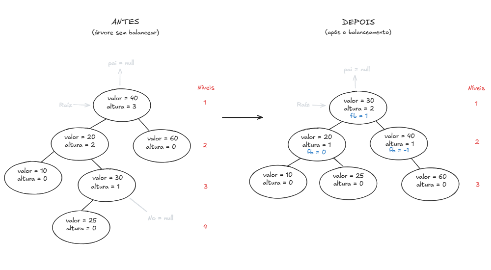
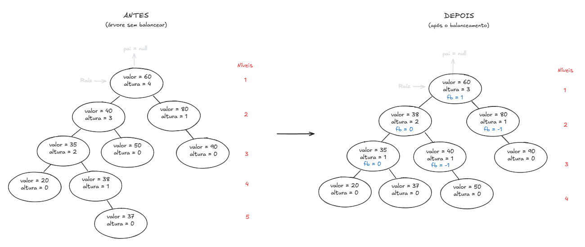
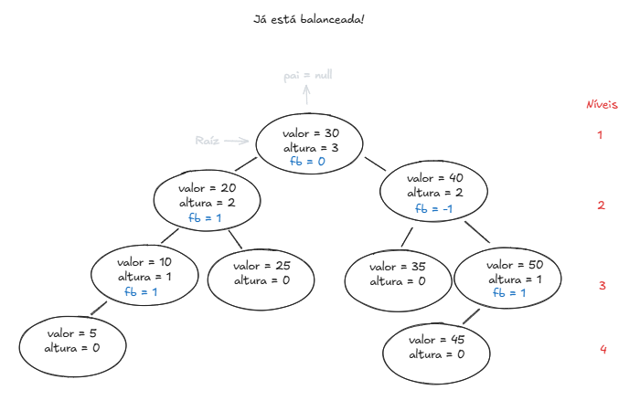

# Estrutura de Dados II

## Pseudocódigo da lógica para inserção em árvores AVL

### Caso base e caso recursivo

- Chamar _adicionarNo(valorDoNo)_
  
- Verificar se o nó sendo percorrido existe
  - Criar um nó com _valorDoNo_
  - Definir o pai do nó
  - Definir a altura do nó como 0
  - Devolver o nó par adicioná-lo e terminar a execução

- Verificar se o nó sendo percorrido é menor que o valor
  - Se sim, o filho esquerdo do nó sendo percorrido receberá um novo nó com o valor

- Verificiar se o nó sendo percorrido é maior que o valor  
  - Se sim, o filho direito do nó sendo percorrido receberá um novo nó com o valor

---

### Calcular alturas e fatores de balanceamento

- Salvar a altura do nó
  - Obs: Nó sendo percorrido recebe 1 mais o máximo entre as alturas do seu filho esquerdo e direito

- Calcular o fator de balanceamento
  - Obs: Fator de balanceamento recebe altura do seu filho esquerdo menos a altura do seu filho direito

- Aplicar rotação
  - Decidir qual rotação utilizar
  
  ### **Lado esquerdo desbalanceado**

  - Se o fator de balanceamento for maior que 1 _(fb > 1)_
    - Se o valor inserido for menor que o valor do filho esquerdo do nó desbalanceado _if (valorInserido < noDesbalanceado.esquerdo.valor)_
      <!-- Rotação simples à direita (LL) -->
      - Fazer rotação simples à direita

    - Se o valor inserido for maior que o valor do filho esquerdo do nó desbalanceado _if (valorInserido > noDesbalanceado.esquerdo.valor)_
     <!-- Rotação dupla à direita (LR) -->
    - Fazer rotação simples à esquerda no filho esquerdo do nó desbalanceado
    - Fazer rotação simples à direita no nó desbalanceado
  
  ### **Lado direito desbalanceado**

  - Se o fator de balanceamento for menor que -1 _(fb < -1)_
    - Se o valor inserido for maior que o valor do filho direito do nó desbalanceado _if (valorInserido > noDesbalanceado.direito.valor)_
      <!-- Rotação simples à esquerda (RR) -->
      - Fazer rotação simples à esquerda

    - Se o valor inserido for menor que o valor do filho direito do nó desbalanceado _if (valorInserido < noDesbalanceado.direito.valor)_
      <!-- Rotação dupla à esquerda (RL) -->
      - Fazer rotação simples à direita no filho direito do nó desbalanceado
      - Fazer rotação simples a esquerda no nó desbalanceado

- Devolver o nó atual para continuar a recursão

## Rotações 

### Rotação Simples à Direita
- Se o fator de balanceamento for maior que 1 e o valor inserido for menor que o valor do filho esquerdo do nó desbalanceado

### Rotação Simples à Esquerda
- Se o fator de balanceamento for menor que -1 e o valor inserido for maior que o valor do filho direito do nó desbalanceado

## Desenho das árvores

### Ordem de inserção: [40, 20, 60, 10, 30, 25]

  

---

### Ordem de inserção: [60, 40, 80, 35, 50, 90, 20, 38, 37]

  

---

### Ordem de inserção: [30, 20, 10, 25, 40, 50, 5, 35, 45]

  

